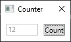
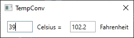

# SevenGUIs

This is a practice implementation of [7GUIs](https://eugenkiss.github.io/7guis/tasks). It uses WPF and ReactiveUI as a base.

## Counter


This is a trivial implementation. ViewModel contains a command that adds 1 to a bindable property every time it's called.
The command is bound to the `<Button>` in the UI.

## Temperature Converter


There are several approaches here. 

1. No viewmodel needed. The Fahrenheit `TextBox` can be relative-bound to to the Celsius `TextBox.Text` through a converter with `Convert()` (that does C->F conversion) and `ConvertBack()` (F->C).

2. (current implementation) ViewModel stores a `Celsius` and `Fahrenheit` bindable properties. `Celsius` setter updates the `Fahrenheit` private field and raises `PropertyChanged(Fahrenheit)`.

Setting the private field is preferred to using the public setter directly: `Fahrenheit = value * 9...`. Calling the `Fahrenheit` setter would trigger an update to `Celsius`, triggering a set to `Fahrenheit`, and so on, leading to an infinite loop.

Having `decimal? Celsius/Fahrenheit` properties serves several purposes. If the user hasn't entered anything, both TextBoxes would be empty instead of showing `0.0`. 
If the user enters non-numerics, WPF's binding conversion throws an exception due to different types (string in UI, decimal? in VM).

3. ReactiveUI commands and calculated properties. The viewmodel would look like this:
 
```csharp
CalculateCelsiusCommand = ReactiveCommand.Create<decimal, decimal?>(CalculateCelsius);
_celsius = CalculateCelsiusCommand.ToProperty(this, x => x.Celsius);

private static decimal? CalculateCelsius(decimal value)
{
    return (value - 32) * (5m / 9m);
}
```

The view would invoke the respective commands on `KeyUp` and would be bound one-way from the `Celsius/Fahrenheit` source properties.

```csharp 
Celsius.Events().KeyUp
        .Select(ev => ((TextBox)ev.Source).Text)
        .Where(t => decimal.TryParse(t, out _))
        .Select(decimal.Parse)
        .InvokeCommand(ViewModel, vm => vm.CalculateFahrenheitCommand);
```

```xaml
<TextBox Grid.Column="0" Text="{Binding Celsius, Mode=OneWay, UpdateSourceTrigger=PropertyChanged}" x:Name="Celsius" />
```